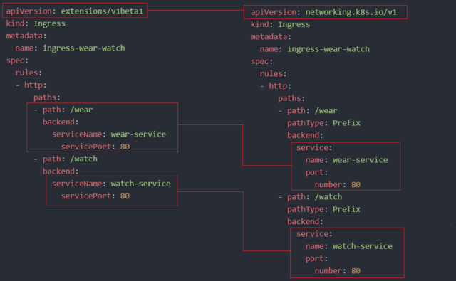

## Ingress

In this article, we will see what changes have been made in previous and current versions in Ingress.

Like in `apiVersion`, `serviceName`, `servicePort` etc.



Now, in k8s version **1.20+** we can create an Ingress resource via the imperative way like this:

```bash
$ kubectl create ingress <ingress-name> --rule="host/path=service:port"
```

Example:

```bash
$ kubectl create ingress ingress-test --rule="wear.my-online-store.com/wear*=wear-service:80"
```

Find more information and examples in the below reference link:

- https://kubernetes.io/docs/reference/generated/kubectl/kubectl-commands#-em-ingress-em-

*References:*

- https://kubernetes.io/docs/concepts/services-networking/ingress
- https://kubernetes.io/docs/concepts/services-networking/ingress/#path-types
